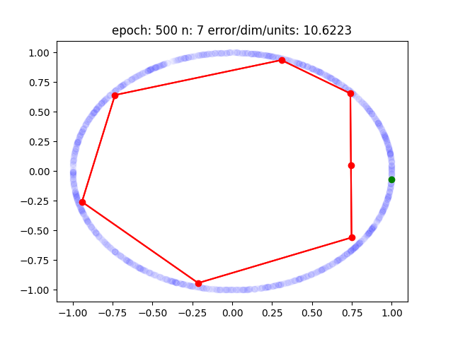
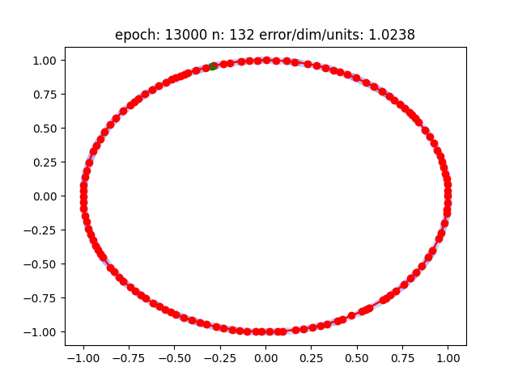
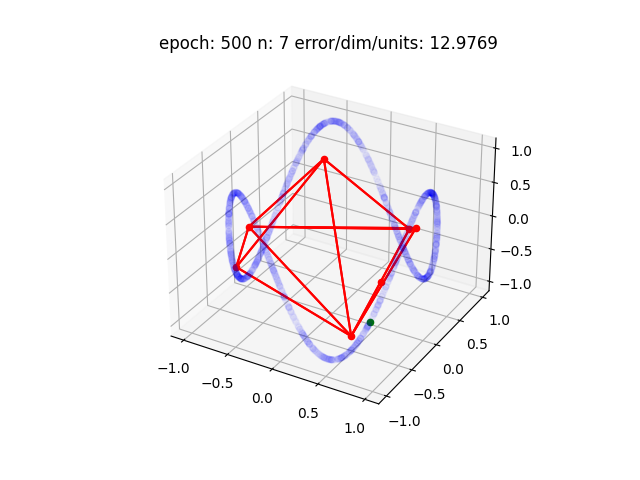
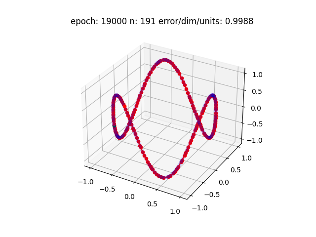
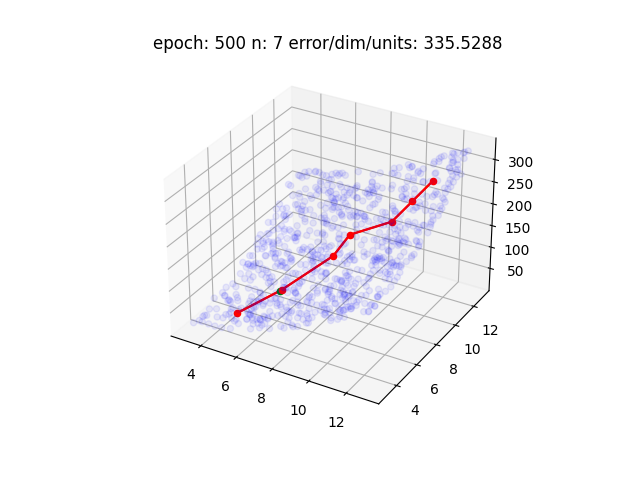
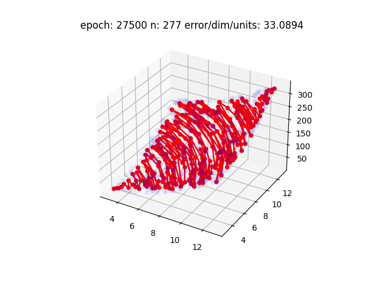

# GrowingNeuralGas
Growing Neural Gas algorithm from "A Growing Neural Gas Network Learns Topoligies" by Fritzke B. 

Example usage: 
~~~
from GNG.neuralgas import GraphNeuralGas
from example.distributions import Box, Circle, TiltedCircle, HypPar  #this is mimiking some data 

NG = GraphNeuralGas(
    distribution=HypPar(n=800),
    growing_rate=100,
    eps_b=0.2,
    eps_n=0.006,
    a_max=50,
    beta=0.995,
    alpha=0.5,
    plot_rate=500,
    figpath='./example/HypPar3d',
    gas_d=3,
    max_number=500,
    min_number=50,
    error_tolerance=1,
)
NG.evolve(steps=100000)
~~~
Examples

Circle

TwistedCircle3d

Surface3d

